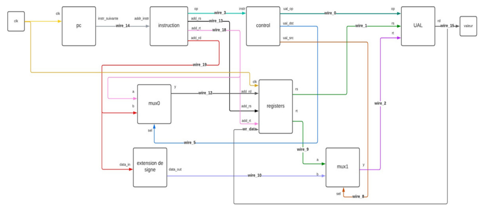

# Processor8bits

## Intro

The aim of this project was to design and build an 8-bit processor using the VHDL language. To achieve this, several stages were followed, from the design of the overall architecture to the simulation of the processor's behavior using Modelsim, in order to validate its behavior and all the operations performed.

## Global architecture 

The 8-bit processor will provide an 8-bit coded output value during each clock cycle, using different instructions from different blocks.

## Docs

[Report (.pdf)](docs/processor8bits.pdf)